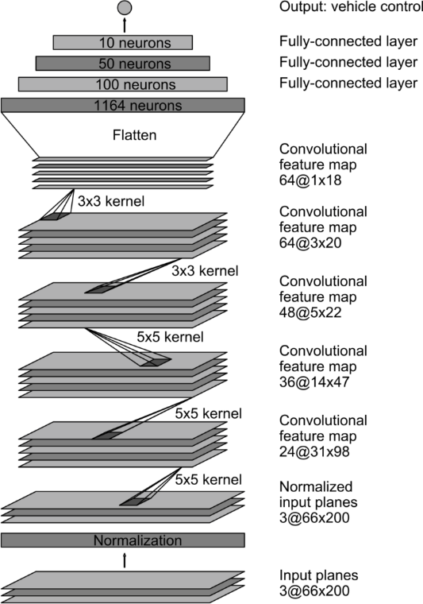
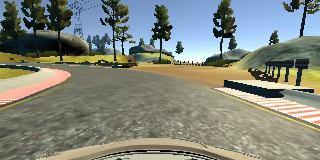
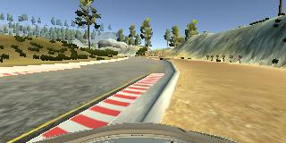
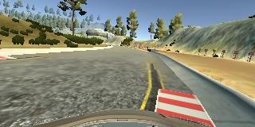
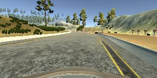
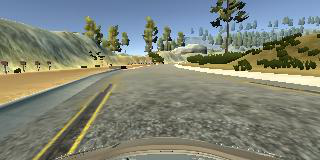

Behavioral Cloning
==================

Brian Fischer
-------------

**Project Writeup**

**Behavioral Cloning Project**

The goals / steps of this project are the following: \* Use the simulator to
collect data of good driving behavior \* Build, a convolution neural network in
Keras that predicts steering angles from images \* Train and validate the model
with a training and validation set \* Test that the model successfully drives
around track one without leaving the road \* Summarize the results with a
written report

Rubric Points
-------------

### Here I will consider the [rubric points](https://review.udacity.com/#!/rubrics/432/view) individually and describe how I addressed each point in my implementation.

### Files Submitted & Code Quality

#### 1. Submission includes all required files and can be used to run the simulator in autonomous mode

My project includes the following files: \* model.py containing the script to
create and train the model \* drive.py for driving the car in autonomous mode \*
model.h5 containing a trained convolution neural network \* writeup_report.md or
writeup_report.pdf summarizing the results

#### 2. Submission includes functional code

Using the Udacity provided simulator and my drive.py file, the car can be driven
autonomously around the track by executing

~~~~~~~~~~~~~~~~~~~~~~~~~~~~~~~~~~~~~~~~~~~~~~~~~~~~~~~~~~~~~~~~~~~~~~~~~~~~~~~~
python drive.py model.h5
~~~~~~~~~~~~~~~~~~~~~~~~~~~~~~~~~~~~~~~~~~~~~~~~~~~~~~~~~~~~~~~~~~~~~~~~~~~~~~~~

#### 3. Submission code is usable and readable

The model.py file contains the code for training and saving the convolution
neural network. The file shows the pipeline I used for training and validating
the model, and it contains comments to explain how the code works.

### Model Architecture and Training Strategy

#### 1. An appropriate model architecture has been employed

My model consists of a Convolutional Neural Network (CNN). Architecture is based
upon the NVIDIA implementation described at
<https://devblogs.nvidia.com/parallelforall/deep-learning-self-driving-cars/>

There are three 5x5 layers (lines 104-106) with depths between 24 and 48.

There are two 3x3 layers (lines 110-11) with depths of 64.

The model includes RELU layers to introduce nonlinearity (lines 104-126), and
the data is normalized in the model using a Keras lambda layer (line 96).

#### 2. Attempts to reduce overfitting in the model

The model contains dropout layers in order to reduce overfitting (lines 118,
121).

The model was trained and validated on different data sets to ensure that the
model was not overfitting (lines 15). Data was combined via manual copying and
merging of the driving_log.csv. The model was tested by running it through the
simulator and ensuring that the vehicle could stay on the track.

#### 3. Model parameter tuning

The model used an adam optimizer, so the learning rate was not tuned manually
(model.py line 129).

#### 4. Appropriate training data

Training data was chosen to keep the vehicle driving on the road. I used a
combination of center lane driving, recovering from the left and right sides of
the road, and additional data in areas that did not contain lane markings.

For details about how I created the training data, see the next section.

### Model Architecture and Training Strategy

#### 1. Solution Design Approach

The overall strategy for deriving a model architecture was to provide a model
that could drive with a reasonably sized and balanced data set.

My first step was to use a convolution neural network model similar to the LeNet
architecture. I thought this model might be appropriate because it worked well
in the traffic sign classification project. After experiencing poor results, I
decided to crop out above the horizon along with the hood of the vehicle. The
results were a little better, but the car was not stable on the track. I decided
to switch to the NVIDIA architecture that was recommended later in the project
lessons. This was very exciting as I saw very good results from the first
attempt.

In order to gauge how well the model was working, I split my image and steering
angle data into a training and validation set. I found that my first model had a
low mean squared error on the training set but a high mean squared error on the
validation set. This implied that the model was overfitting.

To combat the overfitting, I modified the model so that dropout was used in the
fully connected layers 7 and 8,

The final step was to run the simulator to see how well the car was driving
around track one. Results of this were quite good as the vehicle drove mostly
around the track. I noticed the vehicle had trouble in the dirt corners and
would not recover once it left the road. It was clear that some additional
training data around dirt corners and recovery was required.

At the end of the process, the vehicle is able to drive autonomously around the
track without leaving the road.

#### 2. Final Model Architecture

The final model architecture (model.py lines 80-126) consisted of a convolution
neural network based upon the NVIDIA architecture with some dropout.

Here is a visualization of the architecture:

#### 3. Creation of the Training Set & Training Process

I started with the Udacity data set which had good driving behavior. I then
added some data from the second track to generalize the training data set.

Here is an example image of center lane driving:

I then recorded the vehicle multiple times in corners without markings as
depicted above. In addition to this, I added recovery driving from the left side
and right sides of the road back to center so that the vehicle would learn to
correct itself. These images show what a recovery looks like starting from ... :

To augment the data sat, I also flipped images and angles thinking that this
would also generalize the data set. This also increased the number of samples
from a single data set to save time.

Here is the last image from recovery that has then been flipped:

After the collection process, I had 55,974 number of data points. I then
preprocessed this data by normalizing it from -1 to 1. The original values were
0-255.

I finally randomly shuffled the data set and put 20% of the data into a
validation set.

I used this training data for training the model. The validation set helped
determine if the model was over or under fitting. The ideal number of epochs was
2 as evidenced by the fact that additional epochs did not increase the accuracy.
I used an adam optimizer so that manually training the learning rate wasn't
necessary.
